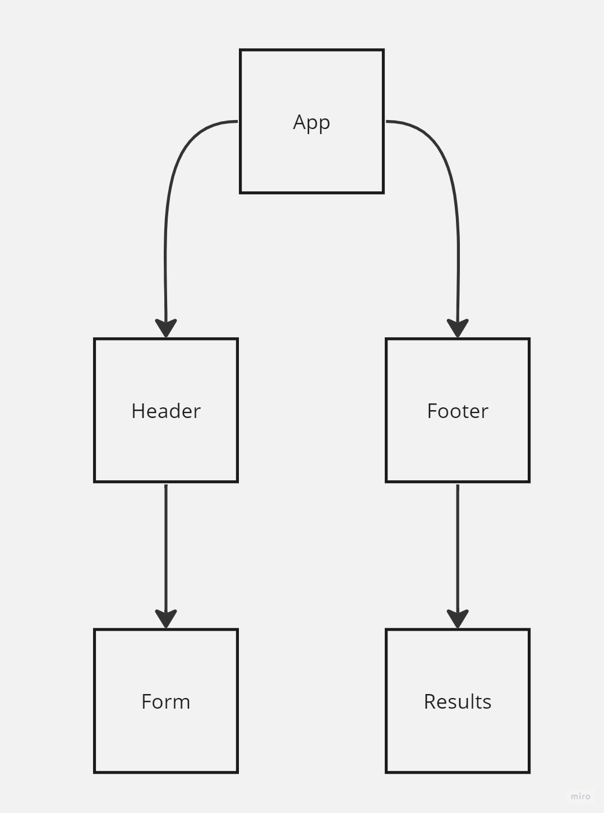
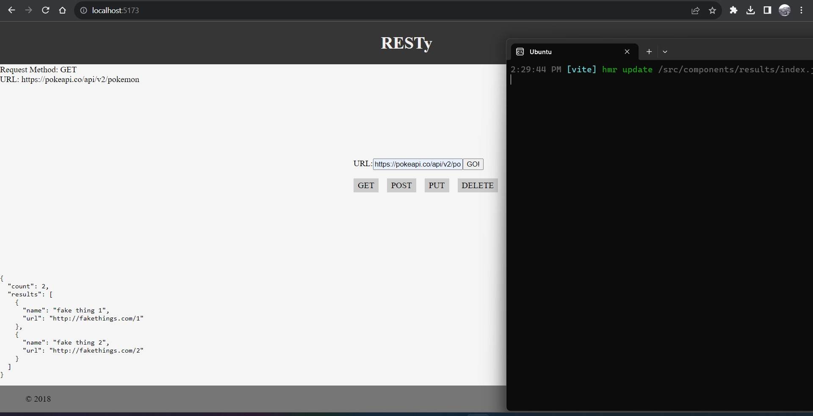

# React + Vite

This template provides a minimal setup to get React working in Vite with HMR and some ESLint rules.

Currently, two official plugins are available:

- [@vitejs/plugin-react](https://github.com/vitejs/vite-plugin-react/blob/main/packages/plugin-react/README.md) uses [Babel](https://babeljs.io/) for Fast Refresh
- [@vitejs/plugin-react-swc](https://github.com/vitejs/vite-plugin-react-swc) uses [SWC](https://swc.rs/) for Fast Refresh

--------------------------------------------------------------------------

## Changes has been made: 

1. All components in src has been changed except <App > as requested (The <App /> component serves as the container for all sub-components of this application.
Leave this component as a Class.)

2. Ensured that the <Header />, <Footer />, <Results /> and <Form /> components are imported using ES6 import syntax.

3. Core application functionality should remain unchanged.
The <Form /> component should:
Call a function onSubmit() that updates the <App /> component via a function sent down as a prop so that the app can process the form values.
The <Results /> component should show mock API results.

to start the program in terminal "npm run dev".
