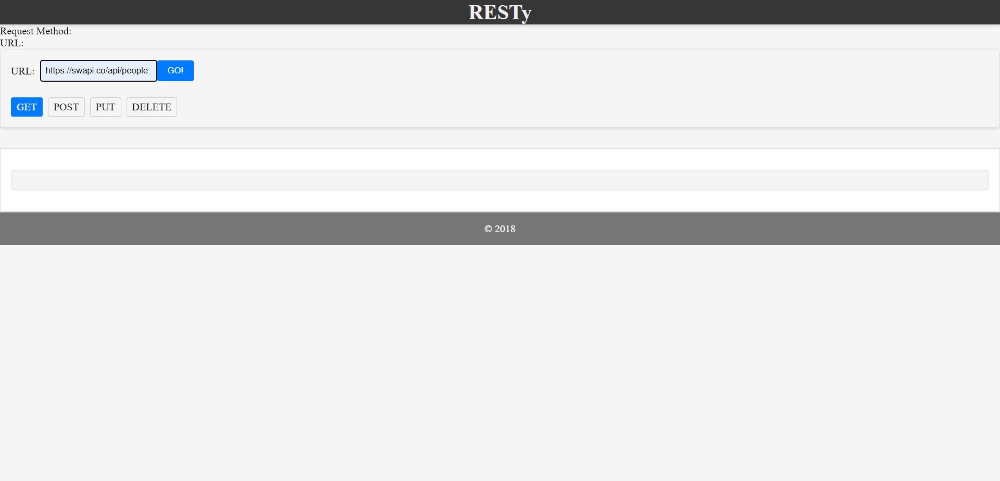
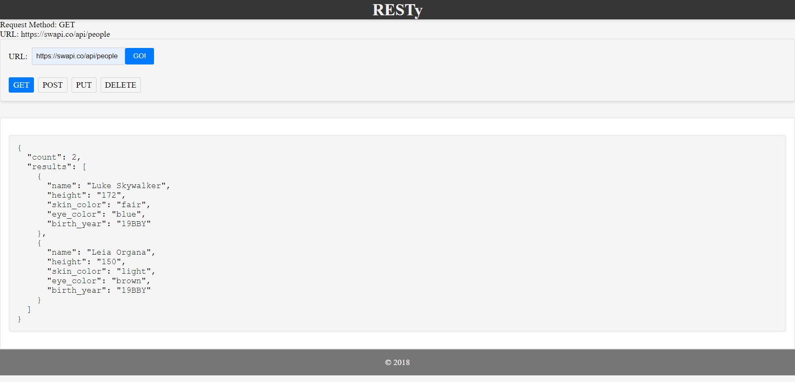
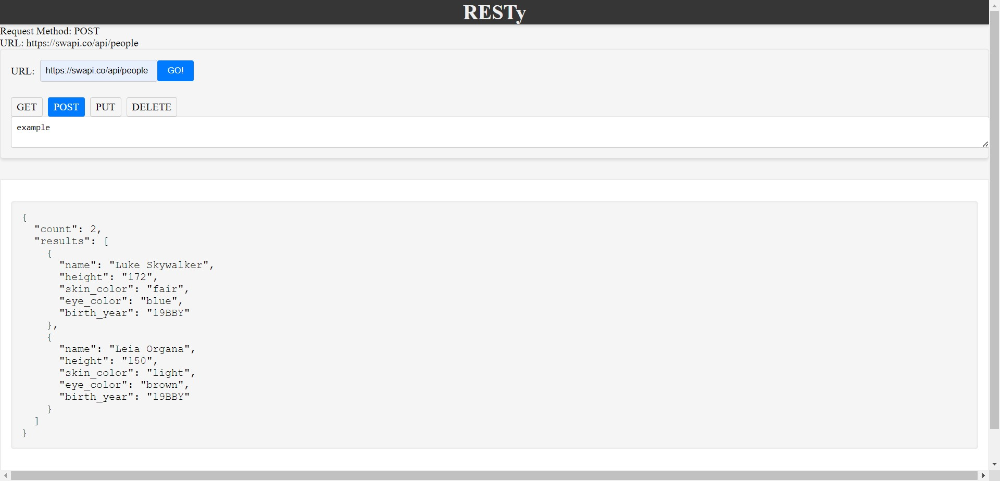

# RESTy

RESTy is a simple React application that allows users to interact with APIs by making GET, POST, PUT, and DELETE requests. It provides a user-friendly interface for inputting API URLs, selecting request methods, and viewing the API response data.

## Features

- Send GET, POST, PUT, and DELETE requests to APIs.
- Display the API response data in a "pretty printed" JSON format.
- Show loading messages while simulating API calls.

## Getting Started

in terminal, write "npm run dev" to start the application 

## Usage

1. Enter the API URL in the provided input field.
2. Select the desired request method (GET, POST, PUT, DELETE).
3. For POST and PUT methods, enter JSON data in the textarea.
4. Click the "GO!" button to simulate the API call.
5. View the results and response data displayed in the lower section of the page.

### Added

- Implemented user input for JSON data in POST and PUT requests.
- Display loading messages while simulating API calls.
- Added styling enhancements for a more professional look.

### Changed

- Refactored components to use the useState hook for state management.
- Replaced the loading message in the Results component with a loading spinner.

### Photos for required 

these photos are example of the changes in the methods and the look for the application.
