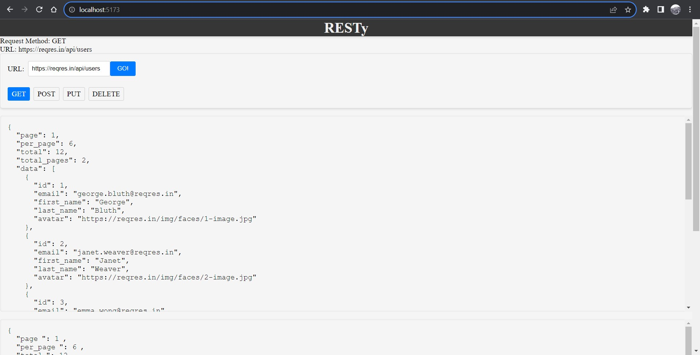

# Resty

## Phase 3 Changes

### Components

1. **Form Component (form.jsx):**
   - Accepts `handleApiCall` prop for form submissions.
   - Supports URL, method (GET, POST, PUT, DELETE), and JSON data.

2. **App Component (app.jsx):**
   - Uses `fetch` for HTTP requests.
   - Manages state with `useState` and `useEffect` hooks.
   - Displays request info above Form.

3. **Results Component (results.jsx):**
   - Shows error message on request failure.
   - Utilizes `react-json-pretty` for JSON display.
   - Includes pagination data (if available).

   

To run App : " npm run dev "
