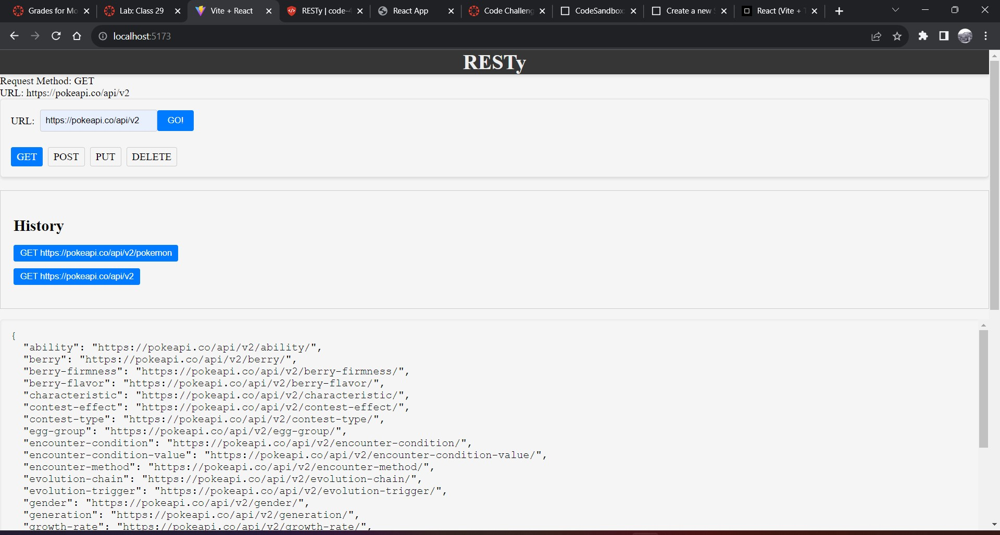
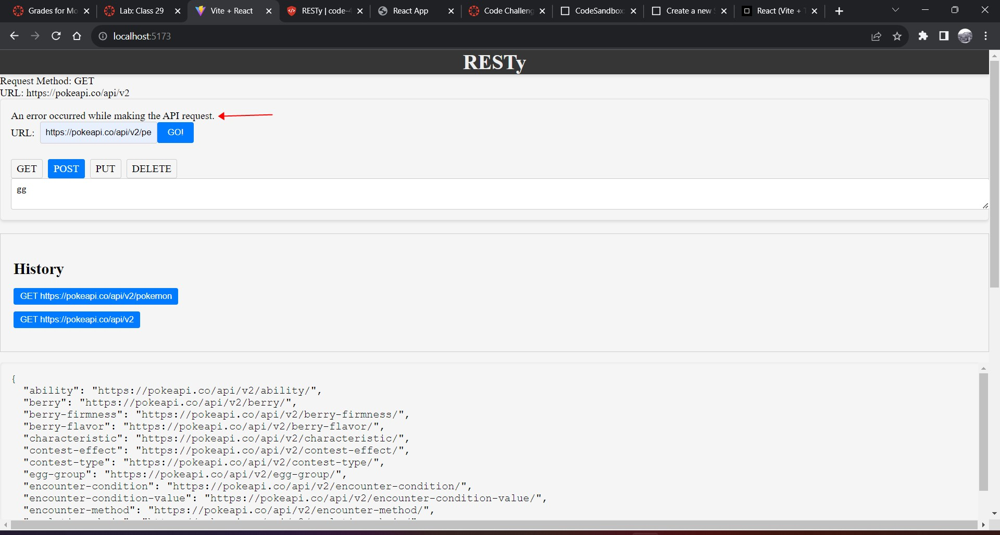
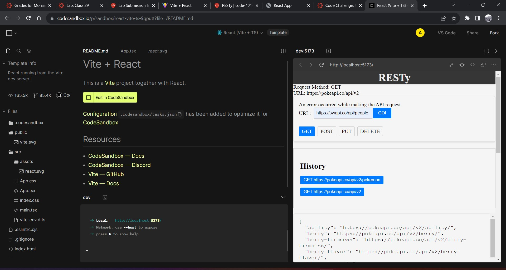

# Resty App

## Application Flow:

- User enters an API URL.
 - Chooses a REST Method.
 - Clicks the “Go” button.
 - Application fetches data from the URL given, with the method specified.
 - Application stores the API request and returned data into state.
 - Updates the list of previous API calls.
 - Application Displays the response headers and results separately.
 - Both headers and results should be “pretty printed” JSON.

 ## Technical Requirements / Note
- Refactor your state management within the App component to use the useReducer() hook.

- Replace any component state managements to use derived state from useReducer() with a reducer function and initial state.

-- <App />: Use a reducer to store and manage all application state: loading, results, history.
Add to history array in state after every api call
method, url, results (json).

-- <History />: Iterates the history array in state and shows the previous API calls.
When one is clicked on, show the results in the results component.
Note: the results component renders whatever is in state.

### Edits for lab:
- history.jsx and history.scss has been added 
- useReduce() has been used in app.jsx as requested 
- history now shows when you access a right API with get 

- wrong methods or wrong inserted in API methods or URL will shows *"An error occurred while making the API request."*

